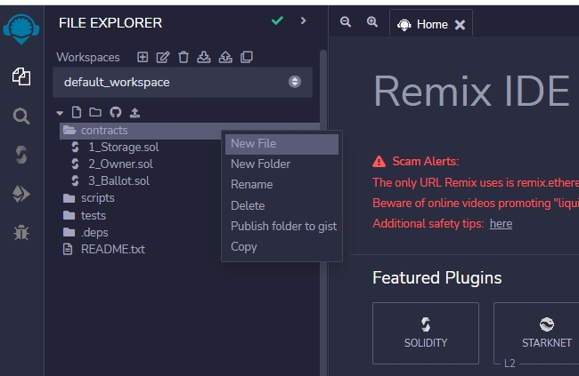
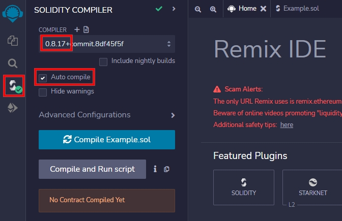
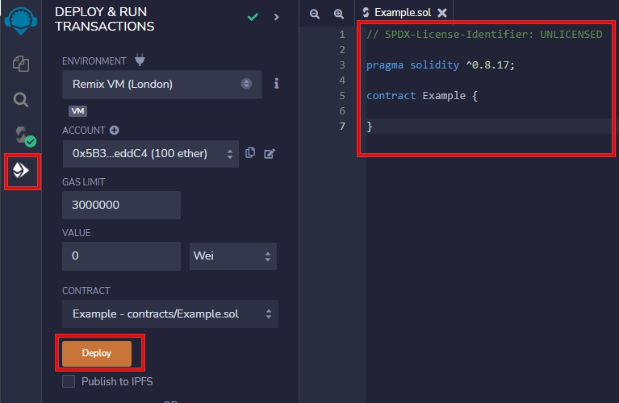

# Solidity Tutorial
Learn Solidity From Examples.

## Table of Contents  
- [Solidity Tutorial](#solidity-tutorial)
  - [Table of Contents](#table-of-contents)
  - [Online IDE](#online-ide)
  - [Basic Structure](#basic-structure)


## Online IDE
We are going to use [Remix IDE](https://remix.ethereum.org/) to test our examples.

Steps to follow:
1. Create a new file. Say __Example.sol__
   
   
2. Select the latest compiler version and Turn on __Auto compile__
   
   
3. Write the following code to __Example.sol__ and __Deploy__
   
   

[🔝Back to Table of Contents](#table-of-contents)

## Basic Structure
```solidity
// SPDX License Identifier: Every source file should start with a comment indicating its license:
// SPDX-License-Identifier: MIT

// Pragmas: The pragma keyword is used to enable certain compiler features or checks.
pragma solidity ^0.8.17;

// Contracts: Contracts in Solidity are similar to classes in object-oriented languages. They contain persistent data in state variables, and functions that can modify these variables.
contract Example {
    // Comments: Single-line comments (//) and multi-line comments (/*...*/) are possible
    // This is a single-line comment.

    /*
    This is a
    multi-line comment.
    */
}

// NatSpec comments: Mainly used for doumentation. They are written with a triple slash (///) or a double asterisk block (/** ... */) and they should be used directly above function declarations or statements.

/// @author The Solidity Team
/// @title A simple storage example
contract SimpleStorage {
    uint storedData;

    /// Store `x`.
    /// @param x the new value to store
    /// @dev stores the number in the state variable `storedData`
    function set(uint x) public {
        storedData = x;
    }

    /// Return the stored value.
    /// @dev retrieves the value of the state variable `storedData`
    /// @return the stored value
    function get() public view returns (uint) {
        return storedData;
    }
}
```

[🔝Back to Table of Contents](#table-of-contents)


